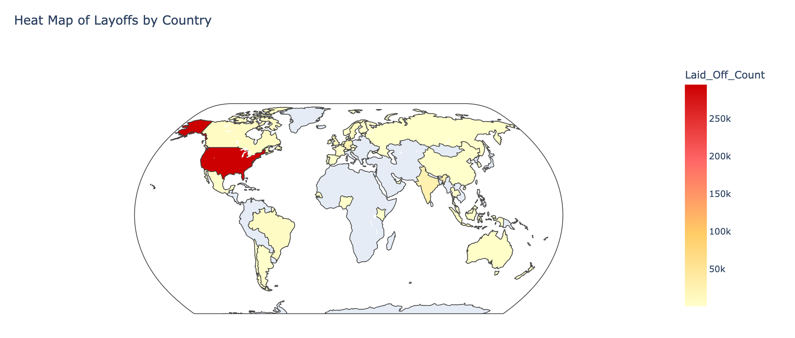
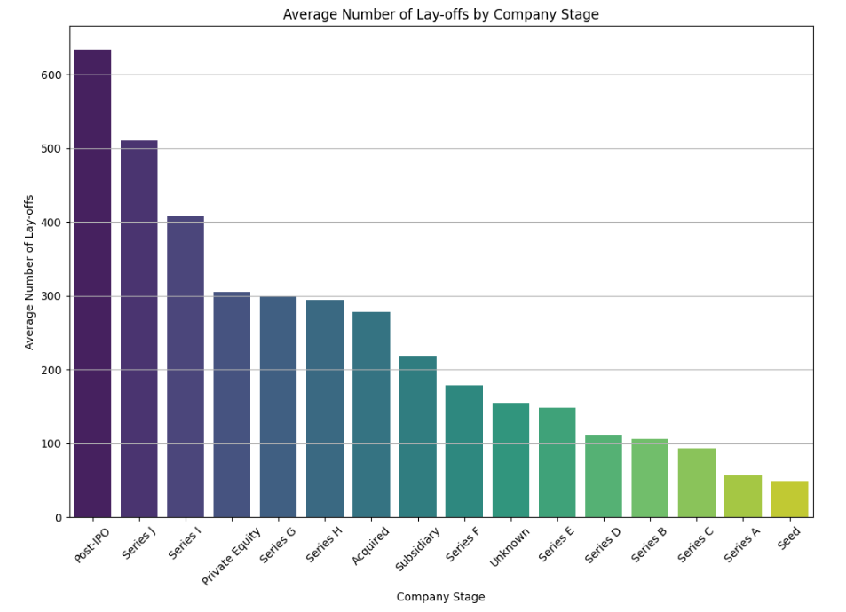
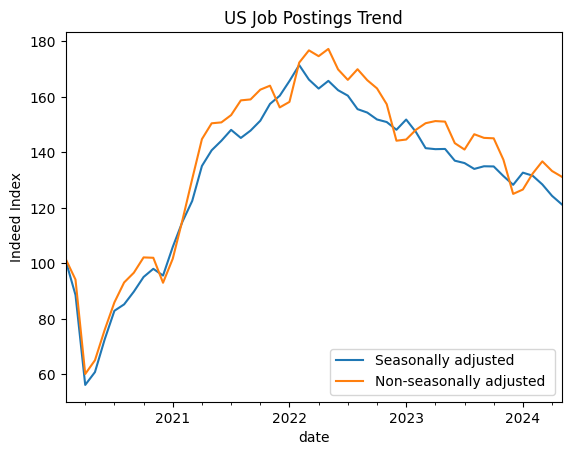

# Tech Layoff Analysis 

# Giới thiệu

## Giới thiệu chung

Hiện nay, cắt giảm nhân sự đang trở thành một trong những vấn đề nhức nhối đối với cả người lao động và doanh nghiệp và cả chúng ta. Trong bối cảnh kinh tế toàn cầu không ổn định và sự cạnh tranh ngày càng khốc liệt, nhiều công ty đã buộc phải cắt giảm nhân sự để duy trì hoạt động. Điều này không chỉ ảnh hưởng đến các cá nhân bị sa thải mà còn tạo ra tâm lý bất an trong những người lao động hiện tại, ngoài ra còn tác động tiêu cực đến năng suất và tinh thần làm việc của họ.

Làn sóng cắt giảm nhân sự này xuất phát từ nhiều lý do, bao gồm qui mô công ty, cơ cấu kinh tế, sự phát triển công nghệ, tái cơ cấu tổ chức, và những thách thức kinh tế vĩ mô. Đặc biệt, trong bối cảnh hậu đại dịch COVID-19, các doanh nghiệp còn phải đối mặt với những khó khăn tài chính và sự thay đổi trong nhu cầu thị trường.

Với những thắc mắc về lý do đằng sau các đợt sa thải và tác động của chúng đối với từng cá nhân và tổ chức, việc phân tích dữ liệu sa thải trở nên cực kỳ quan trọng. Bài thuyết trình này sẽ tập trung vào việc sử dụng các phương pháp phân tích dữ liệu để khám phá, phân tích các dữ liệu liên quan đến tình trạng cắt giảm nhân sự, nhằm giúp chúng ta hiểu rõ hơn về các xu hướng, nguyên nhân và tác động của hiện tượng này.

## Giới thiệu dataset

1. [Layoff Dataset 2024](https://www.kaggle.com/datasets/theakhilb/layoffs-data-2022)
    
    Đây là tập dữ liệu được thu thập từ trang web “Layoffs.fyi” - Một trang web được tạo ra để theo dõi tình trạng lay off kể từ dịch COVID-19.
    
    Tập dữ liệu có các trường sau:
    
    - **`Company:` Tên công ty nơi xảy ra sa thải.**
    - **`Location_HQ:` Vị trí trụ sở của công ty.**
    - **`Industry:` Ngành hoặc lĩnh vực của công ty.**
    - **`Laid_Off_Count:` Số lượng nhân viên bị sa thải.**
    - **`Percentage:` Phần trăm lực lượng lao động công ty sa thải.**
    - **`Date:` Ngày tháng của đợt sa thải.**
    - **`Funds_Raised:` Thông tin về Số vốn của công ty.**
    - **`Stage:` Công ty thuộc giai đoạn phát triển nào.**
    - **`Country:` Đất nước mà công ty thuộc về.**
2. [**Indeed Job Postings Index**](https://www.kaggle.com/datasets/kimminh21/job-postings)
    
    Là tập dữ liệu được lấy từ Indeed Hiring Lab về số lượng bài đăng tuyển dụng trên nền tảng Indeed. Nó sử dụng một chỉ số đặc biệt, được đặt là 100 vào ngày 1 tháng 2 năm 2020 và các trường  thay đổi theo tỷ lệ phần trăm từ thời điểm đó.
    
    Hiện tại có 7 quốc gia được bao gồm trong tập dữ liệu này: Úc, Canada, Đức, Pháp, Anh, Ireland và Mỹ.
    
    Tập dữ liệu gồm nhiều tập dữ liệu con, gồm các trường sau:
    
    - date: Ngày tháng năm ghi lại dữ liệu
    - jobcountry: Nước mà công ty đăng bài tuyển dụng
    - indeed_job_postings_index: % tăng trưởng số bài đăng tuyển dụng tính từ 01/02/2020
    - display_name: Ngành tuyển dụng
3. [**BEA Corporate Profits by Industry 2022-2024**](https://www.kaggle.com/datasets/kimminh21/bea-corporate-profits-by-industry-2022-2024)
    
    Đây là dữ liệu lợi nhuận doanh nghiệp theo ngành từ Cục Phân tích Kinh tế Hoa Kỳ (BEA).
    
    Tập dữ liệu có các trường sau:
    
    - Industry:  Ngành nghề
    - Date: Quý theo từng năm
    - Billions of Dollars: Lợi nhuận thu về theo quý
4. [**NASDAQ-100 Technology Sector Index 2019 - 2024**](https://www.kaggle.com/datasets/kimminh21/nasdaq-100-technology-sector-index-2019-2024)
    
    Chỉ số chứng khoán ngành công nghệ NASDAQ-100 2019 - 2024
    
    Tập dữ liệu có các trường sau:
    
    - Date: Ngày giao dịch
    - Close/Last: Giá đóng cửa
    - Open: Giá mở cửa
    - High: Giá cao nhất
    - Low: Giá thấp nhất
5. [**World GDP Growth**](https://www.kaggle.com/datasets/sazidthe1/world-gdp-growth)

    Là tập dữ liệu về GDP các nước trên thế giới, gồm thông tin quan trọng như tên quốc gia, loại chỉ số và mức tăng trưởng trung bình hàng năm của nền kinh tế từ năm 1980 đến năm 2024.

    Tập dữ liệu có các trường sau:

    - country_name: Tên nước
    - Các trường dữ liệu năm, từ 1980 - 2024: Giá trị GDP theo năm

# Phân tích các yếu tố ảnh hưởng, nguyên nhân của làn sóng cắt giảm nhân sự

## Về khía cạnh địa lý

### Mỹ và phần còn lại

**Câu hỏi đầu tiên mà chắc ai trong chúng ta đặt ra là liệu nước nào, châu lục có số lượng sa thải lớn nhất?** 

Bằng cách vẽ 3 biểu đồ: 1. Biểu đồ heat map theo các nước trên thế giới 2. Biểu đồ số lượng sa thải theo các châu lục (Continent) và 3. Biểu đồ số lượng sa thải của top 5 nước sa thải nhiều nhất, ta có thể rút ra kết luận như sau:

Ta có thể thấy biểu đồ heat map chênh lệch như thế nào khi một mình Hoa Kỳ có màu đỏ rực trên bản đồ.

Mỹ chứng kiến số lượng người bị sa thải cao nhất, với xấp xỉ 300.000 người mất việc. Ngoài ra, số lượng người bị sa thải ở Mỹ còn chiếm gần toàn bộ số lượng người bị sa thải ở Châu Mỹ khi số lượng sa thải ở châu mỹ chỉ trên mức 300k như biểu đồ 2. 

Các công ty Ấn Độ đứng thứ hai về tỷ lệ sa thải người, với gần 50.000 nhân viên từ các công ty Ấn Độ mất việc, tiếp theo là Đức và Vương quốc Anh.

### Ấn độ có tổng số người sa thải hơn hẳn châu Á, châu Âu có phần cân bằng hơn.

Phía trên là biểu đồ về top 3 nước của Châu Mỹ, Châu Âu, Châu Á về tổng số người bị sa thải. Với màu xanh thì ta có thể thấy số người sa thải ở Hoa Kỳ hơn hẳn so với châu Mỹ. Tương tự là Ấn Độ ở Châu Á. Châu Âu có phần cân bằng hơn.

**Một số lí do cho việc Ấn Độ có lượng sa thải lớn nhất Châu Á**

- Lực lượng lao động lớn: Ấn Độ có lực lượng lao động lớn, với hơn 500 triệu người làm việc trong nhiều lĩnh vực khác nhau. Điều này có nghĩa là ngay cả một tỷ lệ nhỏ bị sa thải cũng có thể chuyển thành một con số lớn.
- Ngành Tech lớn, và Ấn độ là điểm đến phổ biến cho outsourcing phần mềm: Cho nên các công ty tech lớn của Ấn Độ thường phải tái cơ cấu và sa thải cho phù hợp với xu thế thế giới.

**Một số lí do cho việc Châu Âu có số lượng sa thải câng bằng hơn: Liên minh Châu Âu có một số bộ luật như sau:**

- Bộ luật bảo vệ người lao động, văn hoá quyền lợi công nhân: Liên minh châu Âu (EU) có các luật lao động và quy định nghiêm ngặt bảo vệ quyền lợi của công nhân, bao gồm cả những quy định liên quan đến việc sa thải. Ví dụ, Chỉ thị “**Collective Redundancies - 1988”** đặt ra qui định doanh nghiệp cần tham vấn ý kiến của người lao động khi có ý định sa thải trên 20 người trong vòng 90 ngày.
- Hỗ trợ từ chính phủ: EU thường hỗ trợ cho các ngành khi gặp khó khăn, điều này dẫn tới giảm thiểu tình trạng sa thải nhân viên thay vào đó tái cơ cấu và thích ứng với khó khăn.

### Tuy nhiên, số lượng sa thải nhiều không tương đương với việc xác suất bạn mất việc có cao không.

- Biểu đồ 1
    
    ### **Đây là biểu đồ về tổng số lượng sa thải và trung bình tỷ lệ sa thải theo quốc gia**
    
    Mặc dù **Hoa Kỳ** có tổng số lượng sa thải rất cao nhưng tỉ lệ sa thải không cao lắm. Các nước theo sau Hoa Kỳ về tổng số lượng sa thải như Ấn Độ, Đức, Vương quốc Anh đều có phần trăm sa thải trung bình ở mức cao hơn Hoa Kỳ. 
    
- Biểu đồ 2
    
    Đây là biểu đồ phân bố phần trăm sa thải ở 3 quốc gia sa thải nhiều nhất:
    
    ta có thể thấy hoa kì có phần trăm trung bình nhỏ hơn 2 quốc gia còn lại, và IQR cũng hẹp hơn tuy nhiên lại có rất nhiều Outlier với tỉ lệ sát với 100%
    
- Nhìn chung
    
    ### Lí giải một số yếu tố tác động đến xác suất sa thải:
    
    1. **Tác động của quy mô công ty**:
        - Các công ty qui mô lớn ở Hoa Kỳ đã góp phần gây ra số lượng sa thải khổng lồ do lực lượng lao động lớn của họ. Khi các công ty này sa thải, số lượng nhân viên bị ảnh hưởng cao, nhưng tỷ lệ phần trăm có thể không cao như các công ty nhỏ hơn ở các quốc gia khác.
        - Ngoài ra, từ biểu đồ 2, ta có thể thấy sự dải rất rộng và rất nhiều Outlier của thị trường Hoa Kỳ làm ta rút ra được đây là thị trường khổng lồ với qui mô công ty rất đa dạng
        - Các quốc gia có số lượng sa thải ít hơn nhưng quy mô công ty nhỏ nên có thể có tỷ lệ cao sa thải hơn vì lực lượng lao động tương đối nhỏ hơn.
    2. **Các yếu tố kinh tế và thị trường, pháp lý**:
        - Điều kiện kinh tế, nhu cầu thị trường và xu hướng ngành ở mỗi quốc gia ảnh hưởng đáng kể đến quyết định sa thải.
        - Ví dụ như biểu đồ trên - với top 10 quốc gia có tổng số nhân viên sa thải cao nhất, dù UK chỉ xếp thứ 4 nhưng tỉ lệ sa thải lại là cao nhất với 27%. Lí do của điều này là do sự điều chỉnh lãi suất ngân hàng của Anh. Gần đây, lãi suất ngân hàng ở Anh đã điều chỉnh từ 0.5 lên 0.75% (lần điều chỉnh cao nhất sau cuộc đại khủng hoảng kinh tế năm 2008). Sự tăng lãi suất ngân hàng này dẫn tới một số điều sau:
            - Các khoản vay ngân hàng cũng tăng lãi suất, từ đó các doanh nghiệp gặp khó khăn khi vay để đầu tư hoặc mở rộng. Dẫn tới nhu cầu lao động giảm và làn sóng sa thải xảy ra.
            - Lãi suất cao làm cho việc vay tiêu dùng như vay mua nhà, mua xe trở nên đắt đỏ hơn. Người tiêu dùng có xu hướng chi tiêu ít hơn, dẫn đến giảm doanh thu cho các doanh nghiệp. Khi doanh thu giảm, doanh nghiệp có thể phải cắt giảm chi phí, bao gồm cả việc sa thải nhân viên.
            - Lãi suất cao có thể làm tăng giá trị đồng bảng Anh, làm cho hàng hóa xuất khẩu của Anh trở nên đắt đỏ hơn đối với người tiêu dùng nước ngoài. Điều này có thể giảm xuất khẩu, làm giảm nhu cầu sản xuất và từ đó dẫn đến giảm nhu cầu lao động.
    
    ### **Phần kết luận:**
    
    - Tóm lại, chỉ riêng số lượng sa thải không cung cấp một bức tranh hoàn chỉnh về tác động của thị trường việc làm. Tỷ lệ sa thải là rất quan trọng để hiểu được tác động tương đối đối với nhân viên.
    - Hoa Kỳ có số lượng sa thải cao nhất do có nhiều công ty lớn nhưng tỷ lệ sa thải ở mức vừa phải.
    - Các quốc gia như Vương quốc Anh và Singapore có tỷ lệ sa thải cao hơn, cho thấy tác động lớn hơn đến lực lượng lao động khi tình trạng sa thải xảy ra.
    
    Bằng cách xem xét cả số lượng sa thải và tỷ lệ sa thải, chúng ta có thể hiểu rõ hơn về động lực của an ninh việc làm và môi trường kinh tế ở các quốc gia khác nhau.
    

### Khu vực SF Bay Area và phần còn lại

cuối cùng của phần lí do theo địa lý là biểu đồ các khu vực có lượng sa thải lớn nhất, ta có thể thấy số lượng sa thải ở Bay Arena Outperforming các khu vực khác

Khu vực SF Bay Arena là nơi chứa Thung lũng Silicon, nơi tập trung nhiều công ty công nghệ, công ty khởi nghiệp và công ty đầu tư mạo hiểm. Khu vực này được biết đến với môi trường cạnh tranh và nhịp độ nhanh, nơi các công ty không ngừng đổi mới và phá vỡ các ngành công nghiệp truyền thống.

Một số lí do khiến Thung lũng Silicon có số lượng sa thải lớn:

- Tập trung các công ty qui mô lớn dẫn tới số lượng sa thải cũng lớn
- Môi trường tăng trưởng cao, rủi ro cao, cạnh tranh khốc liệt
- Nhiều công ty khởi nghiệp ở Khu vực Vịnh SF dựa vào nguồn vốn đầu tư mạo hiểm để thúc đẩy sự phát triển của họ.
- Ngành công nghệ không ngừng phát triển, với các công nghệ và xu hướng mới luôn xuất hiện.

## Về khía cạnh công ty

### Các công ty tới từ Mỹ và Amazon

**Trên là Pie chart cho những công ty Lay off nhiều nhất. Ta lại thấy những công ty Mỹ đứng đầu bảng.**

Ngoài ra, ta có câu hỏi: **Tại sao Tesla đứng đầu bảng với tận 11.4% trong khi những công ty phía sau nó đều sàn sàn mức 6-8%?**

- Đầu tiên ta có thể thấy, trong top 5 thì chỉ có Amazon là công ty thương mại điện tử, còn lại là 1 công ty ô tô và 3 công ty Tech.
- Năm 2020-2021, vì lí do đại dịch, Thương mại điện tử phát triển mạnh chưa từng thấy: từ xx 20% tăng lên 35%. Tuy nhiên, sau 2021, vì các chính sách kiểm soát đã bớt nghiêm ngặt, nó nhanh chóng nguội đi và giảm còn 10-15%.
- Sau đó, doanh số bán lẻ nói chung và thương mại điện tử nói riêng tiếp tục ảnh hưởng bởi sự suy thoái kinh tế.
- Từ đó, các công ty Thương mại điện tử như Amazon bị ảnh hưởng nhiều nhất, dẫn tới làn sóng lay off lớn nhất.

### Industry nào sa thải nhiều nhất?

Biểu đồ này thể hiện tổng số lượng sa thải theo ngành công nghiệp. Nhìn bảo biểu đồ ta thấy ngành bán lẻ (Retail) có số lượng sa thải cao nhất, tiếp theo là các ngành tiêu dùng (Consumer) và vận tải (Transportation). 

Ngành bán lẻ chứng kiến số lượng sa thải cao nhất do sự gia tăng của thương mại điện tử và công nghệ bán hàng tự động, đặc biệt sau đại dịch COVID-19, khi mà nhiều người tiêu dùng đã thay đổi thói quen tiêu dùng và chuyển sang mua sắm trực tuyến. Thêm vào đó, các chuỗi cung ứng bị ảnh hưởng bởi biến động kinh tế toàn cầu cũng góp phần làm suy yếu hoạt động kinh doanh truyền thống.

### Công ty lớn nhỏ, kinh tế của công ty, Stage của công ty có ảnh hưởng thế nào đến việc công ty sa thải

- Vốn hoá
    
    
    
    đầu tiên là biểu đồ ảnh hưởng của mức vốn hoá của công ty với việc sa thải nhân viên
    
    Nhìn vào biểu đồ trên, ta có thể nhận thấy mối quan hệ giữa số vốn góp tương quan với số lượng nhân viên sa thải. Các công ty có thể quyết định sa thải nhân viên như một phần của chiến lược tái cấu trúc để tập trung vào các mảng kinh doanh cốt lõi hoặc loại bỏ các bộ phận không hiệu quả - việc này có thể xảy ra ở bất kỳ mức độ tài chính nào của công ty.
    
    Những điều cơ bản nhận ra từ biểu đồ là phần lớn các công ty có số vốn thấp (dưới 20 triệu USD) có số lượng sa thải tương đối thấp, thường dưới 2000 người. Điều này có thể do các công ty này có ít nhân viên hơn hoặc có ít nguồn lực để mở rộng quy mô, dẫn đến số lượng sa thải thấp hơn khi cần điều chỉnh kinh doanh. Tuy nhiên các công ty có số lượng sa thải nhiều thường có vốn thấp, điều này cho thấy có thể đây là các công ty thất bại trong lĩnh vực và phải tái cơ cấu hoặc phá sản.
    
    Trong khi các công ty có số vốn góp cao (trên 100 triệu USD) đều có số lượng sa thải thấp. Điều này có thể phản ánh khả năng của họ trong việc duy trì hoạt động kinh doanh ổn định hơn và khả năng thích ứng tốt hơn với thị trường mà không cần đến sa thải lớn.
    
- Giai đoạn vốn hoá
    
    
    
    Biểu đồ này thể hiện số lượng sa thải trung bình theo từng giai đoạn phát triển của công ty, từ Seed đến Post-IPO. Cụ thể ta có thể nhận thấy như sau:
    
    Post-IPO và các giai đoạn muộn (Series I, Series J): Những công ty này có số lượng sa thải cao hơn đáng kể so với các giai đoạn khác. Điều này có thể do sau khi IPO, công ty phải đối mặt với áp lực lớn từ thị trường chứng khoán và các nhà đầu tư, yêu cầu hiệu quả hoạt động cao hơn và cắt giảm chi phí. Đối với các công ty Series A và Series B, giai đoạn này là lúc công ty bắt đầu mở rộng quy mô nhanh chóng và cần phải tái cấu trúc để tối ưu hóa hoạt động.
    
    Các giai đoạn đầu (Seed và Series A): Các công ty mới thành lập (seed) và giai đoạn đầu (Series A) có số lượng sa thải ít hơn bởi vì chúng thường nhỏ và chưa mở rộng quy mô. Các công ty ở giai đoạn này thường tập trung vào việc phát triển sản phẩm và công nghệ nên ít có nhu cầu sa thải nhân sự.
    Năm 2024 có thể đánh dấu sự biến động trong kinh tế toàn cầu, ảnh hưởng đến thị trường tài chính và đầu tư. Việc áp dụng công nghệ mới và tự động hóa trong quá trình sản xuất và quản lý có thể dẫn đến việc cắt giảm nhân sự để giảm chi phí và tăng năng suất, đặc biệt là ở các công ty lớn hơn đã có cơ cấu ổn định.
    

## Về khía cạnh thời gian

### Phân bổ trung bình theo tháng của cắt giảm nhân sự

Đây là biểu đồ tròn về số lượng sa thải theo tháng.

Theo biểu đồ đường tròn phía trên, tháng 1 là tháng có số lượng người làm bị buộc nghỉ việc nhiều nhất. Tháng 1 là thời điểm các công ty bắt đầu tổ chức lại và tái kết cấu hệ thống, đặt ra hướng đi và mục tiêu mới cho công ty cho năm mới, dẫn đến việc đuổi việc nhân viên và tuyển nhân viên mới. Tháng 2 cũng là một thời điểm đầu năm mà các công ty dùng để thực hiện việc này.

Tháng có lượng đuổi việc lớn thứ 2 là tháng 11. Tháng 11 là tháng liền trước với Giáng sinh, thời điểm nghỉ lễ và là thời điểm nhân viên được phát lương thưởng trong năm. Việc cắt giảm nhân sự trước Giáng sinh giúp giảm thiểu chi phí phát sinh này.

Các tháng còn lại đều có lượng cắt giảm nhân sự tương đối đồng đều.

### Xu hướng cắt giảm nhân sự theo năm

Nếu chỉ nhìn vào biểu đồ xu hướng phía trên, ta thấy cuối năm 2020, năm 2023 và đầu 2024 là 3 năm có lượng buộc thôi việc lớn hơn hẳn so với những năm còn lại. 

Cuối năm 2020 vẫn là thời điểm toàn bộ thế giới bị ảnh hưởng bởi COVID-19, dẫn đến nhiều công ty bị phá sản hoặc phải cắt giảm chi phí hoạt động để tồn tại. 

Năm 2023 và năm 2024 là thời điểm AI lên ngôi, với sự ra đời của hàng loạt các mô hình ngôn ngữ lớn, với tiên phong là ChatGPT của OpenAI. Điều này có thể đã gián tiếp dẫn đến sự cắt giảm nhân sự, thay thế những vị trí không cần thiết bằng AI.

Nếu ta nhìn vào biểu đồ phân tán trong quãng thời gian này, ta vẫn thấy rõ xu hướng cắt giảm nhân sự có vẻ tăng dần theo thời gian. Tuy nhiên, ta lại thấy năm 2023 không phải là năm có lượng cắt giảm lớn đột biến như biểu đồ đường phía trên. Chỉ có duy nhất 1 tháng giữa năm 2023 là có lượng cắt giảm vượt quá 80000 người, lý do có thể do một số công ty cắt giảm lượng lớn nhân sự, dẫn đến những điểm điểm Outlier này.

Ngoài ra, có một lí do lớn nữa của sự sa thải có vẻ lớn hơn xu hướng, đạt đinh ở năm 2023 là do lí do xu thế tuyển dụng sẽ được trình bày sau đây:

## Xu thế tuyển dụng những năm gần đây tại Mỹ

Do phần lớn các công ty lớn đều nằm ở Mỹ, ta sẽ tập trung xét xu hướng tại Mỹ.

Trên đây là biểu đồ thể hiện xu hướng tăng giảm số lượng bài đăng tuyển việc tại Mỹ trên nền tảng tìm việc Indeed, với mốc 100% tại ngày 01/02/2020, tại thời điểm COVID-19 vẫn đang hoành hành cho đến thời điểm hiện tại, tức năm 2024.

Có 2 đường trên biểu đồ này: seasonally adjusted (được điều chỉnh theo mùa) và non-seasonally adjusted (không điều chỉnh theo mùa), tuy nhiên ta có thể thấy rõ sự khác biệt giữa 2 cách tính này là không đáng kể, xu hướng tuyển dụng vẫn là như nhau theo thời gian.

Giữa năm 2020 là thời điểm các công ty tại Mỹ tuyển dụng nhân sự ít nhất do ảnh hưởng của COVID-19 vẫn rất rõ ràng, giảm chỉ còn dưới 60% so với đầu năm. Sau đó bắt đầu tăng khi thế giới bắt đầu mở cửa trở vào những năm 21, 22, đạt đến đỉnh điểm là tăng trưởng 180% vào năm 2022, rồi có xu hướng giảm dần đến ngưỡng 120% tại thời điểm hiện tại.

Sự tăng đột biến của việc tuyển dụng vào năm 2022 đã dẫn tới dư thừa nhân lực, đây là một lí do rất lớn cho việc sa thải đạt đỉnh vào 2023.

Đối với ngành công nghệ thông tin nói riêng, xu hướng tuyển dụng cũng tương tự với toàn ngành, tuy nhiên có một số điểm khác biệt rõ ràng. Vào thời điểm đỉnh vào năm 2022, số lượng tuyển vào tăng đột biến đến 220% so với mốc năm 2020, tức tăng hơn 2 lần. Sau đó số lượng tuyển dụng này cũng giảm đáng kể đầu năm 2024, gần chạm mốc 60%, tương đương với thời điểm đáy vào năm 2020.

Từ cuối năm 2020 đến giữa năm 2022 cũng là thời điểm các công ty công nghệ thực hiện hình thức Remote Job (làm việc từ xa), giúp cắt giảm chi phí quản lý nhân sự và chi tiêu thụ năng lượng tại nới làm việc, tuy nhiên năng suất làm việc cũng giảm mạnh, dẫn đến phải tuyển dụng bổ sung cho lượng năng suất mất đi. Đây cũng là thời điểm các ứng dụng công nghệ thông tin họp trực tuyến như Zoom, Microsoft Team, … được sử dụng rất rộng rãi, khiến cho khối lượng công việc của các công ty công nghệ tăng rất nhanh, cũng là một lý do dẫn đến sự tuyển dụng ồ ạt này.

Đến giữa năm 2022, nhân viên bắt đầu quay trở lại công ty với hình thức Hybrid (kết hợp làm việc tại nhà và tại công ty), nên số lượng sử dụng ứng dụng trực tuyến vẫn rất nhiều, nên lượng tuyển dụng có giảm nhưng không nhiều. 

Tuy nhiên, đến đầu năm 2023, phần lớn các công ty đều đã quay trở lại hình thức làm việc trực tiếp, dẫn đến nhu cầu sử dụng ứng dụng liên lạc giảm sút, lượng công việc cần để duy trì những ứng dụng này cũng giảm, ít hơn hẳn so với lượng nhân sự có sẵn. Ngoài ra, thị trường tuyển dụng còn ảnh hưởng một phẩn bời AI.

## Ảnh hưởng từ kinh tế

### Lợi nhuận thu về mỗi năm

Ta thấy lợi nhuận của các công ty công nghệ tại Mỹ chạm đáy vào đầu năm 2023, tỉ lệ nghịch với với xu hướng giảm nhân sự của các công ty này, cũng đạt đỉnh vào thời điểm này. 

Ta có thể suy ra rằng lợi nhuận giảm rõ ràng là một nguyên nhân lớn gây ảnh hưởng đến sự cắt giảm nhân sự lớn năm 2023, tuy nhiên sau đó lợi nhuận các công ty này đã tăng trở lại, mặc dù xu hướng cắt giảm nhân sự không hề thay đổi, vẫn tiếp tục tăng. Lý do cho việc này có thể là do sự xuất hiện của AI, tăng trưởng lợi nhuận cho các công ty có sản phẩm AI, đặc biệt là những công ty lớn.

### Giá cổ phiếu các công ty công nghệ trên sàn NASDAQ

Giá cổ phiếu của 100 công ty công nghệ lớn nhất thuộc sàn NASDAQ tỷ lệ thuận với lợi nhuận thu về. Cho thấy sự tương quan rõ ràng giữa giá cổ phiếu của công ty với lợi nhuận và tình trạng buộc thôi việc của các công ty này tại những thời điểm trên biểu đồ.

### Tăng trưởng GDP

Để chắc chắn hơn, ta xét đến tăng trưởng GDP của Mỹ trong giai đoạn từ năm 2018 -2024. Năm 2020 tăng trưởng âm, giống với dự đoán do ảnh hưởng của COVID-19. Năm 2023 tuy tăng trưởng dương nhưng vẫn ít hơn so với trung bình.

Vậy nền kinh tế giảm sút cũng là một nguyên nhân dẫn đến làn sóng cắt giảm nhân sự của các công ty công nghệ. 

# Kết luận

Qua việc phân tích dữ liệu sa thải, ta thấy rõ các yếu tố dẫn đến làn sóng sa thải nhân viên tại các công ty công nghệ ở các khu vực địa lý khác nhau qua từng thời kỳ. Mặc dù Mỹ dẫn đầu về tổng lượng sa thải, xác suất sa thải cho từng nhân viên cá nhân lại tương đối thấp hơn so với các quốc gia như Ấn Độ và Đức, nơi tỷ lệ sa thải cao hơn.

Những nguyên nhân chính bao gồm:

1. **Phân bố địa lý**: Mỹ trải qua số lượng sa thải cao nhất từ các công ty công nghệ lớn. Ấn Độ đứng thứ hai do lực lượng lao động lớn và ngành công nghệ phát triển, trong khi Châu Âu cho thấy sự phân bố sa thải cân bằng hơn do các luật lao động nghiêm ngặt và sự hỗ trợ của chính phủ.
2. **Quy mô và giai đoạn của công ty**: Các công ty lớn hơn và những công ty ở giai đoạn phát triển (hậu IPO) có khả năng sa thải nhiều hơn nhưng không nhất thiết có tỷ lệ sa thải cao hơn. Các công ty ở giai đoạn đầu (Seed, Series A) có xu hướng sa thải ít hơn, phản ánh lực lượng lao động nhỏ hơn và động lực hoạt động khác biệt.
3. **Lợi nhuận và xu hướng thị trường chứng khoán**: Lợi nhuận của các công ty công nghệ, đặc biệt là ở Mỹ, cho thấy mối quan hệ ngược chiều với xu hướng sa thải. Sự sụt giảm lợi nhuận vào đầu năm 2023 đã dẫn đến việc sa thải tăng, mặc dù lợi nhuận đã phục hồi sau đó. Chỉ số công nghệ NASDAQ-100 xác nhận những phát hiện này, chỉ ra mối tương quan trực tiếp giữa giá cổ phiếu, lợi nhuận công ty và làn sóng cắt giảm nhân sự.
4. **Yếu tố kinh tế**: Suy thoái kinh tế, chẳng hạn như đại dịch COVID-19 vào năm 2020 và những điều chỉnh kinh tế do tiến bộ trong AI vào các năm 2023-2024, đã dẫn đến việc sa thải đáng kể. Việc giới thiệu các công nghệ AI như ChatGPT đã thay thế một số vai trò công việc, góp phần thêm vào việc sa thải.
5. **Tác động ngành**: Ngành công nghệ, đặc biệt là các công ty dựa vào vốn mạo hiểm và những công ty trong môi trường tăng trưởng cao, rủi ro cao, cho thấy tỷ lệ sa thải cao nhất.

Tổng thể, bài phân tích này nhấn mạnh sự phức tạp của nguyên nhân gây ra làn sóng sa thải và sự cần thiết của những giải pháp của chính phủ và các doanh nghiệp để giải quyết các thách thức mà cả người lao động và các công ty phải đối mặt trong bối cảnh kinh tế và công nghệ đang thay đổi nhanh chóng.